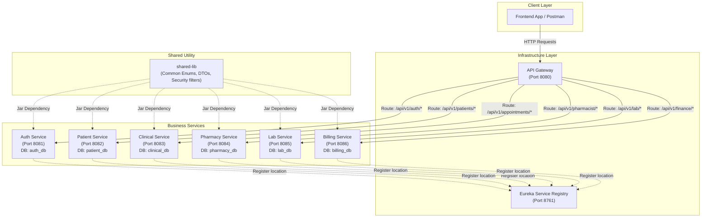
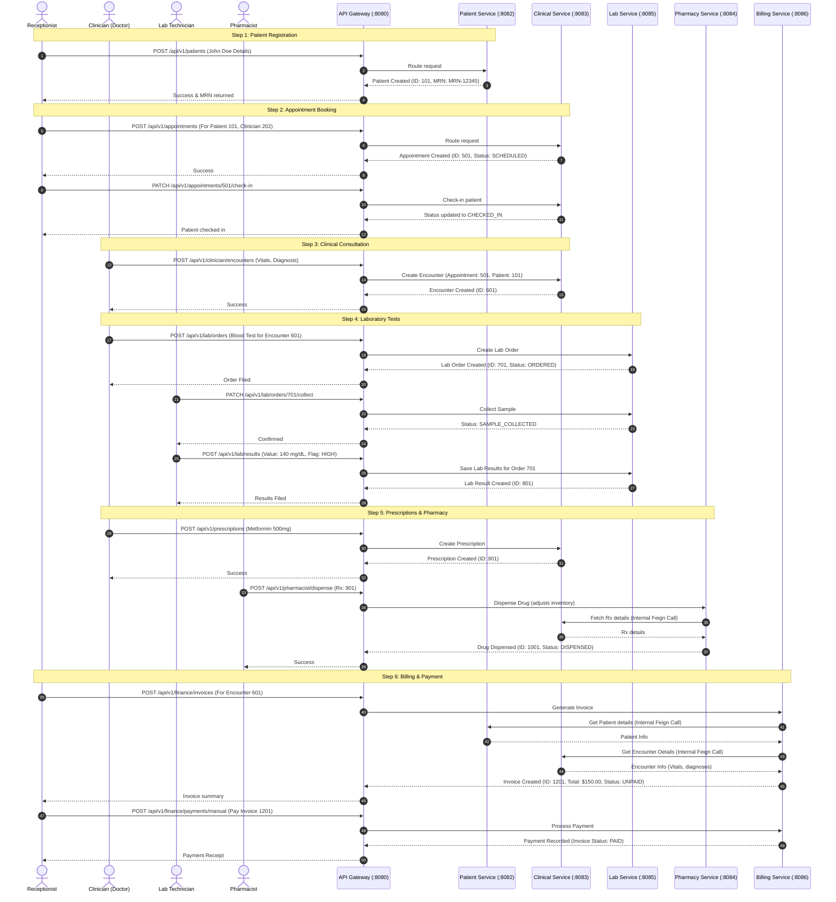

# Clinic-Flow Backend Microservices — End-to-End Explanation & Guide

Welcome to the **Clinic-Flow** backend developer guide! This document is designed to take someone with **zero knowledge** of this project (or microservices in general) and give them a crystal-clear understanding of how everything works, how the services talk to each other, and how a patient's journey flows through the system.

---

## 🏥 1. The Hospital Metaphor: What is a Microservice?

Before diving into code, let's understand how this software is designed. 

In a traditional software system (a **Monolith**), all features—registration, billing, pharmacy, lab—are packaged into one giant application. If one part breaks (e.g., the pharmacy module crashes), the entire hospital system goes down.

**Clinic-Flow** uses a **Microservice Architecture**. Think of it like a real-world modern hospital:
* Instead of one giant department, the hospital is split into specialized units: **Reception**, **Doctors**, **Pharmacy**, **Lab**, and **Billing**.
* Each department operates in its own room, has its own filing cabinets (databases), and has its own staff.
* If the Pharmacy department runs out of paper, the Doctor can still see patients. The departments are **independent**, but they communicate with each other using the hospital's internal intercom or phone system.

Here is how the Clinic-Flow microservices align with real-world hospital departments:

| Real-World Department | Clinic-Flow Microservice | What it Manages |
|---|---|---|
| **Security Guard / Front Desk** | `api-gateway` | The single entrance. Directs patients to the right department. |
| **Hospital Phone Directory** | `eureka-server` | An internal directory listing where every department is located. |
| **HR / ID Badging Office** | `auth-service` | Creates staff accounts and issues security badges (JWT keys). |
| **Receptionist Desk** | `patient-service` | Registers patients and tracks medical charts. |
| **Clinician Room / Doctors** | `clinical-service` | Handles appointments, check-ins, diagnoses, and prescriptions. |
| **Pharmacy Counter** | `pharmacy-service` | Catalogues drugs, tracks inventory, and dispenses medication. |
| **Diagnostic Lab** | `lab-service` | Orders tests, collects blood/tissue samples, and files results. |
| **Cashier / Finance Desk** | `billing-service` | Generates invoices, applies discounts, and processes payments. |

---

## 📐 2. System Architecture

Below is a bird's-eye view of how the client (e.g., a web or mobile app) interacts with our microservices, and how they interact with each other.



### Key Architectural Concepts:
1. **API Gateway (Port 8080)**: Clients never talk directly to individual microservices. They call the Gateway on port `8080`, and the Gateway forwards the request to the correct microservice.
2. **Service Discovery (Eureka - Port 8761)**: When a service starts up, it tells Eureka, "Hey, I'm the `patient-service`, and I am running on IP 192.168.1.10, port 8082." When the Gateway wants to route a patient request, it asks Eureka where `patient-service` is located.
3. **Database-Per-Service**: Each microservice has its own isolated MySQL database. For example, `patient-service` cannot directly read or write to `billing_db`. This ensures that if the billing database goes offline, patients can still be registered.
4. **Shared Library (`shared-lib`)**: A non-runnable codebase containing utility classes (like custom exceptions, common models, and security rules) that all microservices import so we don't repeat code.

---

## 🔄 3. The Patient Journey (End-to-End Workflow)

To see the system in action, let's follow a patient named **John Doe** from the moment he walks into the clinic to the moment he pays his bill. This sequence diagram illustrates how information flows between the services:



---

## 🗣️ 4. How Services Talk to Each Other (Feign Clients)

Because each microservice has its own isolated database, they often need to ask other services for information. They do this using **OpenFeign Clients** (think of this as a coded speed-dial).

For example, when the **Billing Service** needs to create an invoice for John Doe, it does not have his name or address in its database (those live in `patient-service`). 

Here is what happens behind the scenes:
1. `billing-service` invokes `patientClient.getPatientById(101)`.
2. Spring Boot translates this method call into an HTTP request: `GET http://patient-service/internal/patients/101`.
3. Eureka helps resolve `patient-service` to its actual address (`http://localhost:8082`).
4. `patient-service` responds with John Doe's information as a JSON object, which is parsed by `billing-service`.

### The Feign Communication Map:
* All internal calls bypass user authentication and are routed via `/internal/**` prefixes.
* Below are the connections defined in the project:

```
[clinical-service]  ───(GET /internal/patients/{id})───►  [patient-service]
[clinical-service]  ───(GET /internal/users/{id})──────►  [auth-service]
[pharmacy-service]  ───(GET /internal/prescriptions/{id})►  [clinical-service]
[lab-service]       ───(GET /internal/encounters/{id})───►  [clinical-service]
[billing-service]   ───(GET /internal/encounters/{id})───►  [clinical-service]
```

---

## 🔐 5. Security Architecture & The Digital Wristband (JWT)

Clinic-Flow uses **JWT (JSON Web Token) authentication** to secure its endpoints. 

### The Wristband Metaphor
When you check into a music festival or a hospital, you show your ID at the front gate. Once verified, they give you a **wristband**.
* You don't have to show your passport/ID at every food stall or stage; you just show your wristband.
* The wristband lists who you are and what access you have (e.g. VIP, General Admission, Backstage).
* A **JWT** is that wristband. It is a long, digitally signed text string.

### The Security Flow:
1. **Login**: You send your email and password to `/api/v1/auth/authenticate`.
2. **Token Generation**: The `auth-service` validates your credentials, builds a JWT containing your User ID, Name, and Role (e.g., `CLINICIAN`), signs it with a secret key, and sends it back to you.
3. **Authorized Requests**: For every subsequent request, you put this token in the header (`Authorization: Bearer <your-token>`).
4. **Validation**: Each microservice runs the token through a [SharedAuthenticationFilter](file:///d:/Projects/Clinic-Flow-Backend-Microservice/shared-lib/src/main/java/com/HospitalManagement/shared/security/SharedAuthenticationFilter.java). It checks the signature and extracts your role.
5. **Authorization check**: The controller validates if your role matches the `@PreAuthorize` annotation on the endpoint (e.g., only `CLINICIAN` can create encounters).

> [!WARNING]
> ### 🚨 Critical Known Issue: The Pharmacy Role Mismatch
> There is a bug in the security configuration of the **Pharmacy Service**:
> * In `shared-lib`, the user role enum is defined as **`PHARMACIST`**.
> * When a user with this role logs in, their JWT authority is set to `PHARMACIST`.
> * However, inside the [PharmacyController](file:///d:/Projects/Clinic-Flow-Backend-Microservice/pharmacy-service/src/main/java/com/HospitalManagement/pharmacy/controller/PharmacyController.java) and [InventoryController](file:///d:/Projects/Clinic-Flow-Backend-Microservice/pharmacy-service/src/main/java/com/HospitalManagement/pharmacy/controller/InventoryController.java), the endpoints are protected with `@PreAuthorize("hasAnyAuthority('PHARMACY', 'ADMIN')")`.
> * Because **`PHARMACIST`** does not match **`PHARMACY`**, a logged-in pharmacist will receive a **`403 Forbidden`** error when accessing pharmacy endpoints.
> * **Workaround for Testing**: Use an **`ADMIN`** user token to test the pharmacy endpoints, or update the `@PreAuthorize` annotations in the code to check for `PHARMACIST` instead.

---

## 🚀 6. How to Run the Project Locally

### 1. Prerequisites
* **Java 21** (JDK 21) installed.
* **MySQL Database Server** running on `localhost:3306` with username `root` and password `root`.

### 2. Startup Order
Because microservices register with Eureka, and some depend on others being discoverable, they must be started in a specific sequence:

```
Step 1: eureka-server (Port 8761)  - Holds the phonebook
  │
  ▼
Step 2: api-gateway (Port 8080)    - The entrance gate
  │
  ▼
Step 3: auth-service (Port 8081)   - Required for user verification
  │
  ▼
Step 4: All other business services in any order:
        - patient-service  (Port 8082)
        - clinical-service (Port 8083)
        - pharmacy-service (Port 8084)
        - lab-service      (Port 8085)
        - billing-service  (Port 8086)
```

*(Note: On initial startup, the business services will automatically create their respective databases in MySQL, such as `auth_db`, `patient_db`, etc.)*

---

## 🧪 7. Hands-on API Walkthrough (Postman / curl Guide)

Here are the step-by-step requests to test the entire patient journey. 

> [!TIP]
> All external requests go through the API Gateway at **`http://localhost:8080`**. Do not call the individual service ports directly.

### Step 1: Log in and Get your Token
First, log in as the default Administrator to obtain a token.

* **Method**: `POST`
* **URL**: `http://localhost:8080/api/v1/auth/authenticate`
* **Headers**: `Content-Type: application/json`
* **Body (JSON)**:
```json
{
  "email": "rahul.sharma@clinicflow.com",
  "password": "password"
}
```
* **Response**: You will receive a JSON response containing a long `"token"` field. Copy this token!
* **Setup for subsequent requests**: In Postman, go to the **Authorization** tab, select **Bearer Token**, and paste this token.

---

### Step 2: Register a Patient
Now, act as the receptionist and register a new patient.

* **Method**: `POST`
* **URL**: `http://localhost:8080/api/v1/patients`
* **Headers**: `Content-Type: application/json`, `Authorization: Bearer <TOKEN>`
* **Body (JSON)**:
```json
{
  "firstName": "John",
  "lastName": "Doe",
  "dob": "1990-05-15",
  "gender": "MALE",
  "contactInfo": "{\"phone\":\"555-0199\",\"email\":\"john.doe@example.com\"}",
  "address": "{\"street\":\"123 Health Ave\",\"city\":\"Metroville\",\"state\":\"NY\",\"zip\":\"10001\"}",
  "insuranceDetails": "{\"provider\":\"HealthyLife\",\"policyNumber\":\"HL-987654\"}"
}
```
* **Response**: Keep track of the returned `"id"` (let's assume it is `1`) and the `"mrn"` (medical record number).

---

### Step 3: Book an Appointment
Book a checkup appointment for John Doe.

* **Method**: `POST`
* **URL**: `http://localhost:8080/api/v1/appointments`
* **Headers**: `Content-Type: application/json`, `Authorization: Bearer <TOKEN>`
* **Body (JSON)**:
```json
{
  "patientId": 1,
  "clinicianId": 2, 
  "appointmentTime": "2026-06-15T10:00:00",
  "department": "GENERAL_MEDICINE",
  "serviceType": "CONSULTATION",
  "reasonForVisit": "Annual checkup and routine blood tests"
}
```
* **Response**: Note down the returned appointment `"id"` (let's assume it is `1`).

---

### Step 4: Check-In the Appointment
When the patient arrives, check them in.

* **Method**: `PATCH`
* **URL**: `http://localhost:8080/api/v1/appointments/1/check-in`
* **Headers**: `Authorization: Bearer <TOKEN>`
* **Response**: The appointment status changes to `CHECKED_IN`.

---

### Step 5: Create a Doctor's Consultation (Encounter)
A doctor conducts the consultation and logs vitals and instructions.

* **Method**: `POST`
* **URL**: `http://localhost:8080/api/v1/clinician/encounters`
* **Headers**: `Content-Type: application/json`, `Authorization: Bearer <TOKEN>`
* **Body (JSON)**:
```json
{
  "appointmentId": 1,
  "patientId": 1,
  "vitals": "{\"bp\":\"120/80\",\"temp\":98.6,\"hr\":72}",
  "clinicalNotes": "Patient complains of fatigue. Ordered a complete blood count (CBC).",
  "diagnoses": "[\"E87.6 - Fatigue\"]",
  "orders": "[\"CBC_BLOOD_TEST\"]"
}
```
* **Response**: Note down the encounter `"encounterId"` (let's assume it is `1`).

---

### Step 6: File a Lab Order & Results
1. **Create the Lab Order** (Doctor orders a blood test):
   * **Method**: `POST`
   * **URL**: `http://localhost:8080/api/v1/lab/orders`
   * **Headers**: `Content-Type: application/json`, `Authorization: Bearer <TOKEN>`
   * **Body (JSON)**:
   ```json
   {
     "patientId": 1,
     "encounterId": 1,
     "testsRequested": "[\"COMPLETE_BLOOD_COUNT\"]"
   }
   ```
   * **Response**: Returns a lab order `"id"` (assume `1`).

2. **Collect Sample** (Lab Tech draws blood):
   * **Method**: `PATCH`
   * **URL**: `http://localhost:8080/api/v1/lab/orders/1/collect`
   * **Headers**: `Authorization: Bearer <TOKEN>`

3. **File Results** (Lab Tech submits the blood test values):
   * **Method**: `POST`
   * **URL**: `http://localhost:8080/api/v1/lab/results`
   * **Headers**: `Content-Type: application/json`, `Authorization: Bearer <TOKEN>`
   * **Body (JSON)**:
   ```json
   {
     "labOrderId": 1,
     "resultDetails": "{\"hemoglobin\": 13.5, \"wbc\": 6000}",
     "flag": "NORMAL",
     "comments": "All values within normal ranges."
   }
   ```

---

### Step 7: Create a Prescription & Dispense Medicine
1. **Create Prescription** (Doctor prescribes medication):
   * **Method**: `POST`
   * **URL**: `http://localhost:8080/api/v1/prescriptions`
   * **Headers**: `Content-Type: application/json`, `Authorization: Bearer <TOKEN>`
   * **Body (JSON)**:
   ```json
   {
     "encounterId": 1,
     "medicationId": 1,
     "dosage": "500mg",
     "frequency": "ONCE_DAILY",
     "duration": "30 days",
     "instructions": "Take after meals"
   }
   ```
   * **Response**: Note the prescription `"rxId"` (assume `1`).

2. **Dispense Medication** (Pharmacist gives the medicine to the patient):
   * *Remember: Use an **ADMIN** user token here due to the `PHARMACY` role mismatch!*
   * **Method**: `POST`
   * **URL**: `http://localhost:8080/api/v1/pharmacist/dispense`
   * **Headers**: `Content-Type: application/json`, `Authorization: Bearer <ADMIN_TOKEN>`
   * **Body (JSON)**:
   ```json
   {
     "prescriptionId": 1,
     "inventoryItemId": 1,
     "quantityDispensed": 30,
     "remarks": "First fill"
   }
   ```

---

### Step 8: Generate Invoice and Pay
Finally, compile the encounter costs and process the payment.

1. **Create Invoice**:
   * **Method**: `POST`
   * **URL**: `http://localhost:8080/api/v1/finance/invoices`
   * **Headers**: `Content-Type: application/json`, `Authorization: Bearer <TOKEN>`
   * **Body (JSON)**:
   ```json
   {
     "patientId": 1,
     "encounterId": 1,
     "lineItems": "[{\"description\":\"Consultation Fee\",\"amount\":50.00},{\"description\":\"Blood Test CBC\",\"amount\":45.00},{\"description\":\"Prescription Metformin\",\"amount\":25.00}]",
     "subTotal": 120.00,
     "tax": 10.00,
     "discount": 5.00,
     "totalAmount": 125.00
   }
   ```
   * **Response**: Note the invoice `"invoiceId"` (assume `1`).

2. **Record Payment**:
   * **Method**: `POST`
   * **URL**: `http://localhost:8080/api/v1/finance/payments/manual`
   * **Headers**: `Content-Type: application/json`, `Authorization: Bearer <TOKEN>`
   * **Body (JSON)**:
   ```json
   {
     "invoiceId": 1,
     "amount": 125.00,
     "paymentMethod": "CREDIT_CARD",
     "transactionReference": "TXN-99882211"
   }
   ```
   * **Response**: Returns a payment record. The associated invoice status will automatically update to `PAID`.

---

Congratulations! You have completed a full end-to-end walkthrough of the Clinic-Flow Hospital microservices backend! 🚀
